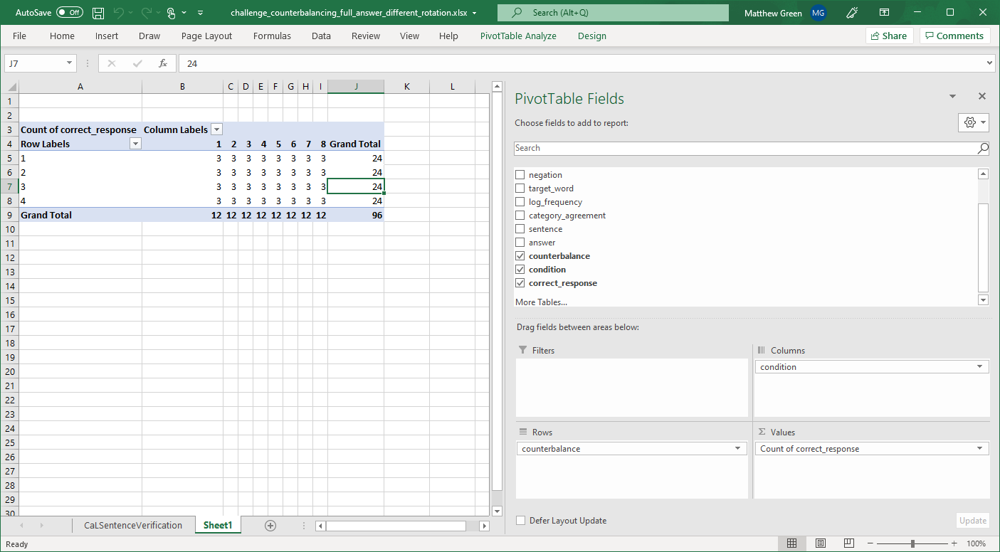

<p style="color:red;">
TODO: parse Tim's email into the html:
</p>
<p style="color:red;">
Hey Matt, this is that email you wanted me to send reiterating why we need a pattern 32 elements long to get the 4 counterbalance lists of 8 conditions. My thinking is that this is related to the fact that 8 times 4 is 32. Since the column of condition numbers sequences from 1-8 repeatedly, we need our counterbalance pattern to change in a way that ensures each list number is paired with each condition number equally often. In fact this is probably a good point to add to the html (I saw your email come in as I was drafting this and the changes look nice).  Currently, I don’t think we have highlighted enough the underlying reason for using counterbalancing—to ensure each participant sees an equal number of stimuli in each of the experimental conditions and that across all participants each item is seen equally often in each of its conditions. Counterbalancing our data set to meet this objective means that we are protecting against the possibility of some items that are just more difficult or time consuming to read dominating the mean of just a few conditions (or a reader who was particularly fast or slow dominating the data for just a few conditions).
</p>
<p style="color:red;">
Back to the 32 elements though. I think the easiest way to conceptualise this is that when you get to 16 elements, in the counterbalance column (which only contains 1-4) each list number will have occurred only 4 times and so it cannot have been adequately represented in all 8 conditions. Furthermore, since the next 16 elements of the condition column (which contains 1-8) will be identical to the first 16 if we just copy the first 16 elements of the counterbalance column again it will simply double the number of pairings of list and condition from the first 16 elements rather than creating the missing pairings. This is why we need the additional mixing. I am sure there is a more elegant maths solution but I am not an elegant mathematician. Does this help?
</p>

```{r, message=F, echo=F}
library(tidyverse)
library(readxl)
library(knitr)
library(kableExtra)
```

No counterbalancing would involve showing the participants the same target word multiple times which would affect their processing of the word as they become more exposed to it - which is not what we want.

Table 1 is the design of the experiment showing how condition number maps to the 2 x 2 x 2 design. The counterbalancing column shows how you would usually do (full) counterbalancing, where you have as many counterbalancing lists as conditions. This way has the advantage that the participant only sees each item once. However this way has the disadvantage that the experimenter has to write very many items.

```{r, echo=F}
design = read_excel("design_with_a_counterbalance_list_for_each_condition.xlsx")
col_fix_wide <- which(colnames(design)=="sentence")
col_fix_narrow <- which(colnames(design)=="category_agreement")
col_bold <- which(colnames(design) %in% c("typicality", "negation", "category_agreement"))
kbl(design, caption="Table 1", align=c(rep('c',times=8),'l','c')) %>% 
  kable_paper(full_width=F) %>% 
  column_spec(col_bold[1], bold = T) %>%
  column_spec(col_bold[2], bold = T) %>%
  column_spec(col_bold[3], bold = T) %>%
  column_spec(col_fix_wide, width="30em") %>% 
  column_spec(col_fix_narrow, width="2em")
```

Table 2 is how the design looks when we avoid writing so many items by making each participant assigned to that list see the same target word twice, but in different conditions. So counterbalance list 1 would present item 1 four times, and participants would read the __mouth__ target word twice and the *liver* target word twice: 

* A person has a __mouth__; 
* A tree has a *liver*; 
* A person does not have a *liver*; 
* A tree does not have a __mouth__.

By the same token counterbalance list 2 would also present item 1 four times, and participants assigned to that list would read the __mouth__ target word twice and the *liver* target word twice, but now in different conditions than in list 1.

* A person has a *liver*; 
* A tree has a __mouth__; 
* A person does not have a __mouth__; 
* A tree does not have a *liver*.

Notice that the counterbalancing column has a pattern to it. It goes: 

* 1,2,2,1; 
* then the inverse of that, so: 2,1,1,2; 
* then we swap those sequences, so: 2,1,1,2; 1,2,2,1
* and that pattern of sixteen numbers 1,2,2,1; 2,1,1,2; 2,1,1,2; 1,2,2,1 would repeat.

```{r, echo=F}
design = read_excel("design.xlsx")
col_fix_wide <- which(colnames(design)=="sentence")
col_fix_narrow <- which(colnames(design)=="category_agreement")
col_bold <- which(colnames(design) %in% c("typicality", "negation", "category_agreement"))
kbl(design, caption="Table 2", align=c(rep('c',times=8),'l','c')) %>% 
  kable_paper(full_width=F) %>% 
  column_spec(col_bold[1], bold = T) %>%
  column_spec(col_bold[2], bold = T) %>%
  column_spec(col_bold[3], bold = T) %>%
  column_spec(col_fix_wide, width="30em") %>% 
  column_spec(col_fix_narrow, width="2em")
```

Having entered values for 1 and 2 in the counterbalancing column, you would copy all the rows with 1 into one spreadsheet, and all the rows with 2 into another. Then, when PsychoPy starts running for a given participant, it selects one of the spreadsheets at random to be the input for this participant. Across many participants you will get approximately equal numbers of people assigned to each counterbalance list.

## Challenge

So far you have seen how to generate 2 counterbalance lists so that participants only read the same target word twice.

The challenge is to make 4 counterbalance lists such that a given participant sees all the target words, but never sees the same target word more than once.

```{r, echo=F}
design = read_excel("challenge_counterbalancing_full_answer_different_rotation.xlsx", sheet="CaLSentenceVerification")
col_fix_wide_category <- which(colnames(design)=="category")
col_fix_wide <- which(colnames(design)=="sentence")
col_fix_narrow <- which(colnames(design)=="category_agreement")
col_bold <- which(colnames(design) %in% c("typicality", "negation", "category_agreement"))
kbl(head(design,64) %>% select(-c(log_frequency,correct_response)), caption="Table 3 Solution", align=c(rep('c',times=9),'l','c')) %>% 
  kable_paper(full_width=F) %>% 
  column_spec(col_bold[1], bold = T) %>%
  column_spec(col_bold[2], bold = T) %>%
  column_spec(col_bold[3], bold = T) %>%
  column_spec(col_fix_wide_category, width="10em") %>% 
  column_spec(col_fix_wide, width="30em") %>% 
  column_spec(col_fix_narrow, width="2em")
```

Notice in the solution given in Table 3 that the pattern repeats every 32 rows. The pattern here is made by doing:

* 1,2,3,4
* 2,3,4,1
* 3,4,1,2
* 4,1,2,3
* then shifting by one to give:
* 2,3,4,1
* 3,4,1,2
* 4,1,2,3
* 1,2,3,4
* then that sequence of thirty-two numbers would repeat.

You can check whether you have done this correctly by doing a pivot table (see the next section Pivot Table Check)

## Pivot table check

If you have done this correctly, then each list will have 3 trials in each of the 8 conditions.

{width=100%}
